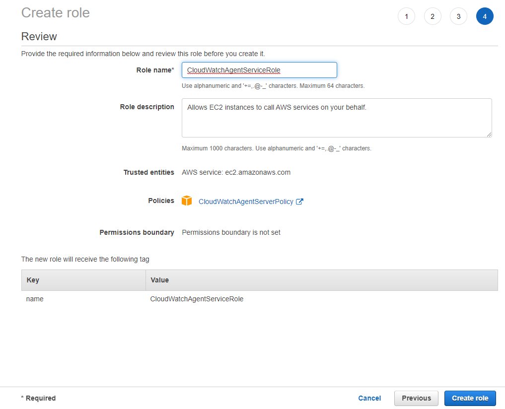
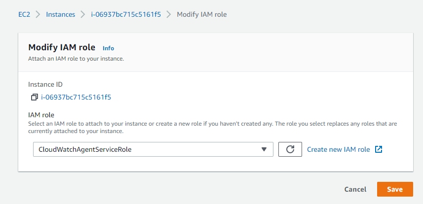
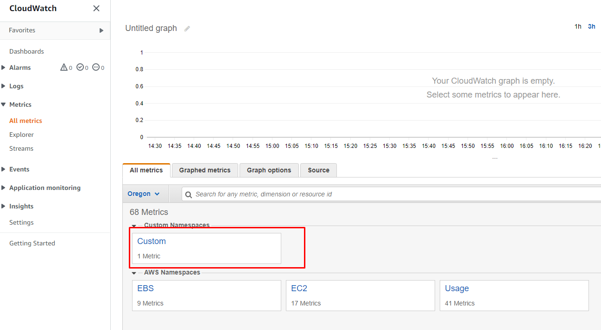

= AWS: Cloud Watch
Dzmitry Marudau <vinmaster@tut.by>
1.0, December 10, 2021: Initial service
:toc:
:icons: font
:url-quickref: https://docs.asciidoctor.org/asciidoc/latest/syntax-quick-reference/

<<<
== Task

Cloud Watch EC2 Custom Metrics

== How to run

* Launch AWS EC2 instance with SSH port 22 enable to connect to it.
* Connect to the instance `ssh -i {PEM_FILE} ec2-user@{PUBLIC_IP_ADDRESS}`
* create a file `mem.sh` f.e. by executing `nano mem.sh` anf fill it by the following content(replace `INSTANCE_ID` by real instance ID):

[source,bash]
----
USEDMEMORY=$(free -m | awk 'NR==2{printf "%.2f\t", $3*100/$2 }')
aws cloudwatch put-metric-data --metric-name memory-usage --dimensions Instance={INSTANCE_ID}  --namespace "Custom" --value $USEDMEMORY
----

* create new EC2 role with `CloudWatchAgentServerPolicy`

[#cloud-watch-ec2-01-servicerole]
.CloudWatchAgentServiceRole


* attach new role to the instance

[#cloud-watch-ec2-02-attach-role]
.Modify EC2 role


* go to EC2 instance and change executable permissions for file `chmod +x mem.sh`

* execute `./mem.sh` +
Result: You must specify a region. You can also configure your region by running "aws configure".

* configure only region by skipping all other options:
```
[ec2-user@ip-172-31-39-11 ~]$ aws configure
AWS Access Key ID [None]:
AWS Secret Access Key [None]:
Default region name [None]: us-west-2
Default output format [None]:
```

* execute `./mem.sh` again

* check that custom metrics is available

[#cloud-watch-ec2-03-view-custom-metrics]
.Check custom metrics


* go to EC2 instance and create crontab by executing `crontab -e` and copy the following content( use `:wq` to exit from vim):

[source,bash]
----
*/1 * * * * /home/ec2-user/mem.sh
----

Result:
```
[ec2-user@ip-172-31-39-11 ~]$ crontab -e
no crontab for ec2-user - using an empty one
crontab: installing new crontab
```

* install stress utilities on EC2:
** `sudo amazon-linux-extras install epel -y`
** `sudo yum install stress-ng -y`

* run stress utility on EC2 `stress-ng --vm 5 --vm-bytes 80% --vm-method all --verify -t 60m -v`
```
[ec2-user@ip-172-31-39-11 ~]$ stress-ng --vm 5 --vm-bytes 80% --vm-method all --verify -t 60m -v
stress-ng: debug: [3638] 1 processors online, 1 processors configured
stress-ng: info:  [3638] dispatching hogs: 5 vm
stress-ng: debug: [3638] cache allocate: default cache size: 30720K
stress-ng: debug: [3638] starting stressors
stress-ng: debug: [3638] 5 stressors spawned
stress-ng: debug: [3643] stress-ng-vm: started [3643] (instance 4)
stress-ng: debug: [3642] stress-ng-vm: started [3642] (instance 3)
stress-ng: debug: [3641] stress-ng-vm: started [3641] (instance 2)
stress-ng: debug: [3640] stress-ng-vm: started [3640] (instance 1)
stress-ng: debug: [3639] stress-ng-vm: started [3639] (instance 0)
```

[#cloud-watch-ec2-04-memory-usage-under-stress.png]
.Memory usage under stress
image::cloud-watch-ec2-04-memory-usage-under-stress.png[emory usage under stress]
