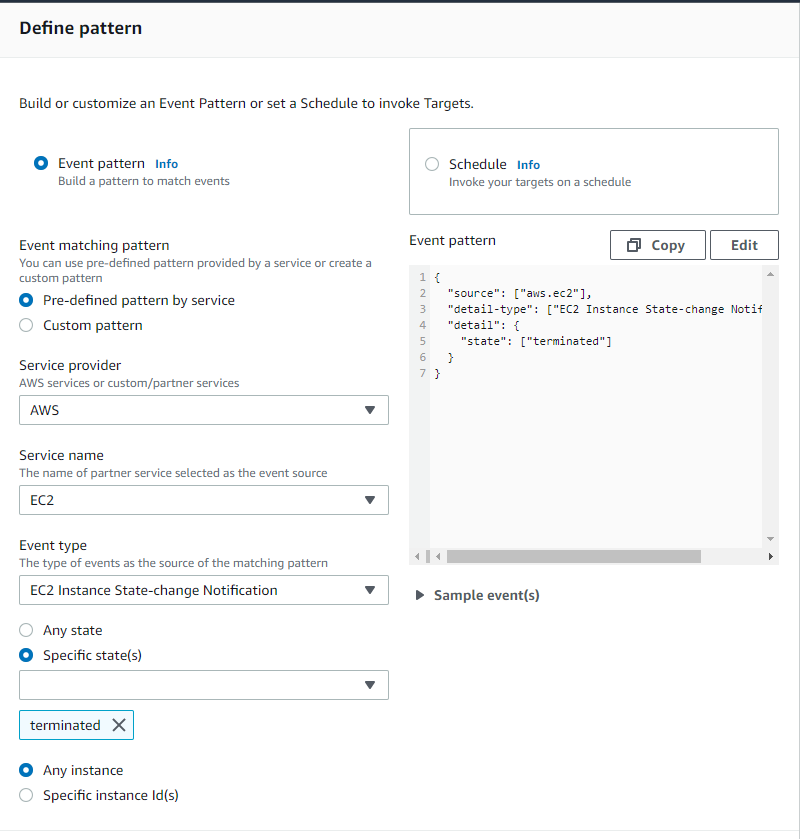
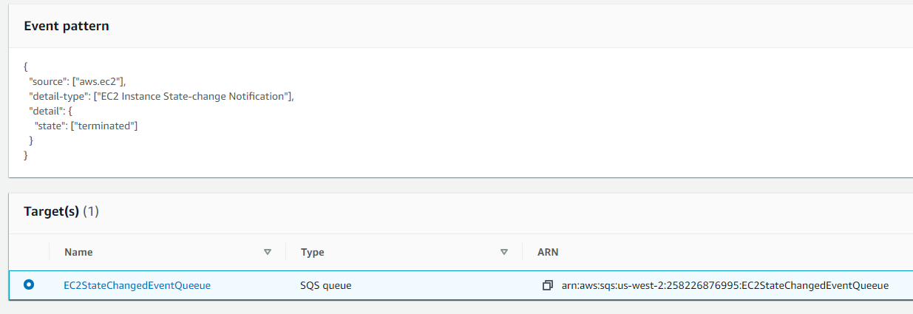
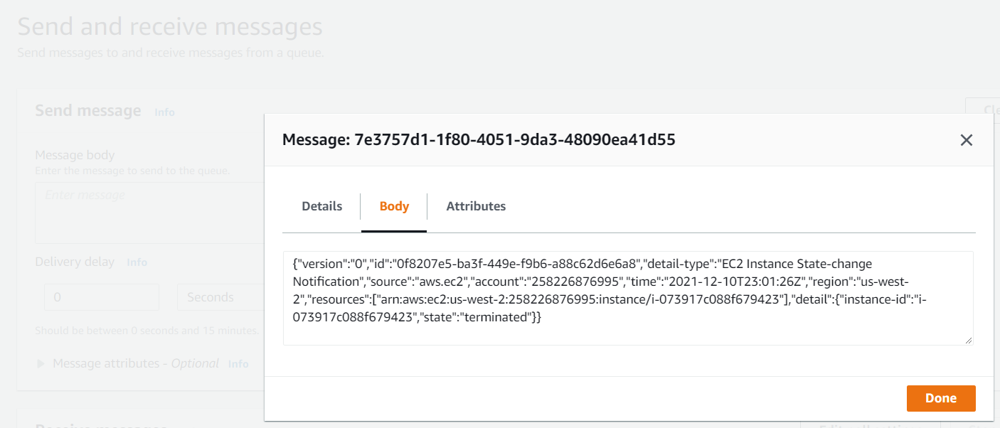

= AWS: Cloud Watch
Dzmitry Marudau <vinmaster@tut.by>
1.0, December 10, 2021: Initial service
:toc:
:icons: font
:url-quickref: https://docs.asciidoctor.org/asciidoc/latest/syntax-quick-reference/

<<<
== Task

Cloud Watch EC2 Event for EC2 instance state change.

== Architecture overview

EC2 --(Instance State Change NOtification)--> Cloud Watch --> SQS Quesue <-(polls for messages)- EC2

== How to run

* Launch AWS EC2 instance with SSH port 22 enable to connect to it

* Create simple queue `EC2StateChangedEventsQueue` at SQS

* Open `EventBridge > Rules` ( previously `Cloud Watch > Events > Rules`) and create new rule based on `Event Pattern`

[#cloud-watch-ec2-01-eventbridge-rule]
.EventBridge Rule

[#cloud-watch-ec2-02-eventbridge-rule-target]
.EventBridge Rule Target

* Terminate running instance to see that message event is published in the queue

[#cloud-watch-ec2-03-event-message]
.Instance Terminated Event

