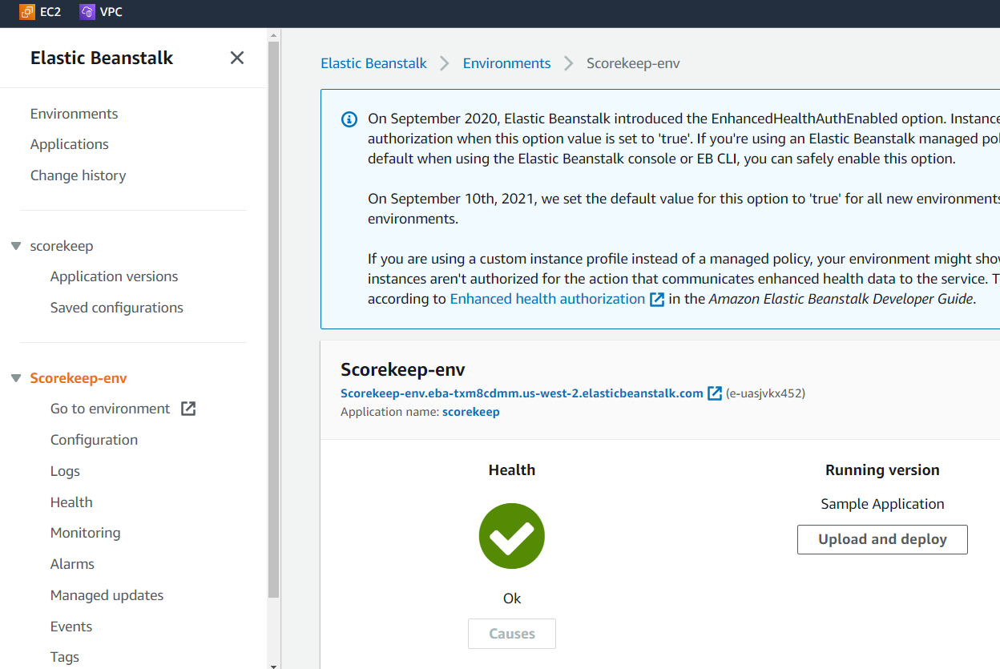
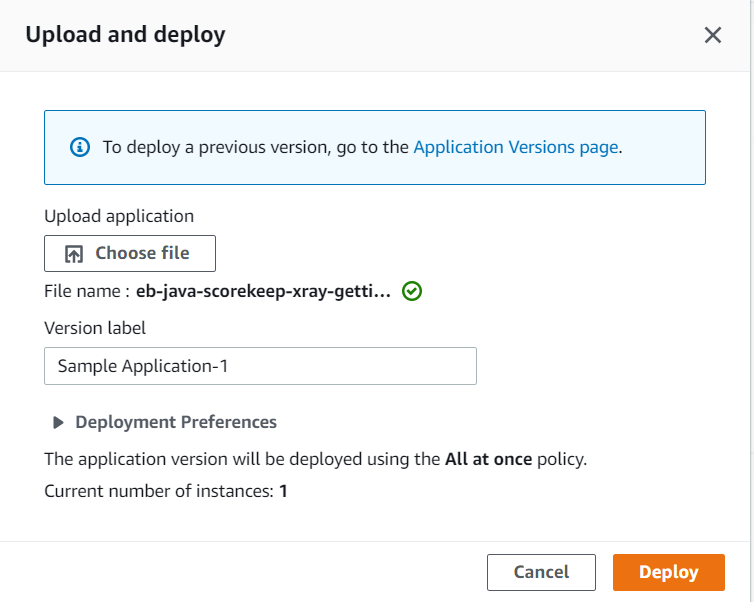

= AWS: Cloud Watch
Dzmitry Marudau <vinmaster@tut.by>
1.0, December 11, 2021: Initial service
:toc:
:icons: font
:url-quickref: https://docs.asciidoctor.org/asciidoc/latest/syntax-quick-reference/

<<<
== Task

Sample Java application(Tic-Tac-Toe game) to generate segments and send them to X-Ray.
It is based on https://docs.aws.amazon.com/xray/latest/devguide/xray-gettingstarted.html

== Architecture overview

== How to run

* Open the link https://us-west-2.console.aws.amazon.com/elasticbeanstalk/home?region=us-west-2#/newApplication?applicationName=scorekeep&solutionStackName=Java

* Choose `Java` as Platform and create `Elastic Beanstalk` environment

[#x-ray-tic-tact-toe-01-elastic-beanstalk-setup]
.Elastic Beanstalk Initial Setup

* Deploy the source code
** Download the sample app: eb-java-scorekeep-xray-gettingstarted-v1.3.zip
** Open the Elastic Beanstalk console.
** Navigate to the management console for your environment.
** Choose Upload and Deploy.
** Upload `eb-java-scorekeep-xray-gettingstarted-v1.3.zip`, and then choose `Deploy`.
** The sample application includes a front-end web app. Use the web app to generate traffic to the API and send trace data to X-Ray.

[#x-ray-tic-tact-toe-01-elastic-beanstalk-deploy]
.Elastic Beanstalk Deploy Application

* We can check what was created
** check CloudFormation
** check Dynamo DB

* Delete Application in the end
** `Elastic Beanstalk` delete
** check `CloudFromation` as well
